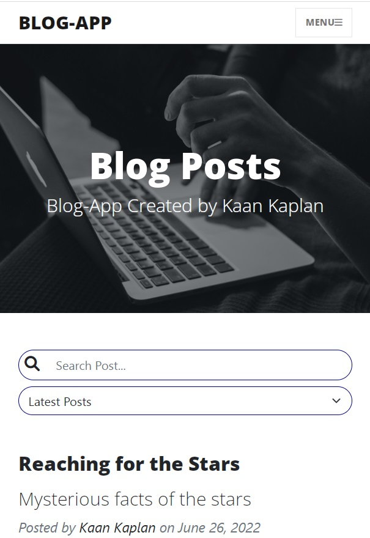

# BlogProject - Frontend
This project is the frontend code of [BlogProject](https://github.com/VonHumbolt/BlogProject). It uses React and Javascript for frontend.

## Brief 

 Blog app project is a website project for people who want to share knowledge with other people. In blog app, users can read and like other people's blog posts, can search and filter posts. They can also write and edit their own posts. However, users must create an account to write and update posts.If users create an account, they can view their profile page and see the posts they like. Users can filter posts by their published date and number of likes. Also, posts can be paginated by users. 

 Users are not required to register to view posts. Every post has a post detail page. In post detail page, users can see the whole post and the person can like the post if they want. In profile page, users can delete and edit their own posts. 

## Technologies

 Inside this project, React, Redux, Bootstrap, Javascript, Css, React Router Dom, Formik, Yup, React Toastify and axios technologies are used.
Bootstrap is used for design of templates. For sending request to api, axios is preffered. 
The state management of the project is provided with Redux. Navigating between pages are provided by the React-Router-Dom.

## UI of Project

 Project contains 8 main pages. 

### Home Page

 On the home page, brief information about the purpose and use of the project is given. The user can quickly navigate to the all posts page or login, register page using the navbar. 

 
    

 
    

### All Posts Page

 One can view every post on the website here. Posts are listed with pagination and every page contains 5 posts.
The user can navigate older and previous posts with pagination buttons. Also, user can search for posts here using the search bar.
All posts can be listed by last published or most liked with filter select box.

 
    

### Post Detail Page

 Users can navigate into this page by clicking on the post. Detail page contains entire post amd post's like count. 
There is a like button at the bottom of the page. Users can like the post using this like button. However, To like a post,
users must have an account.

 
    

### User Profile Page

 Every person with an account has a profile page. People can see other users' profiles and posts.
Users can edit and delete posts and edit profile information on their profile page.
Also, people can view posts they like here.

 
    

### Register Page

 Users use this page to create an account. The form which insides this page generated with Formik and it's validation process is validated with yup. After registration process, an account activation mail is send to user's email address. In order for the user to log in, the user must verify their account using this activation email. <strong> But, I have disabled email verification for convenience for the trial version published in the link at the top of the page. </strong>
 

 
    

### Login Page

 If users have an account, they can login to website. If email or password are incorrect, the user is notified with React Toastify Toast message.

 
    

### Create and Edit Post Page

 Users who have an account, can write blog posts in the create post page. On the edit post page, people can change their posts by editing them. 

 
    

### Responsive UI

 The project's UI has a responsive design. It can work on phones and tablets without breaking the design. 

 
    
    
    
    

## Getting Started with React App

### Available Scripts

In the project directory, you can run:

### `npm start`

Runs the app in the development mode.\
Open [http://localhost:3000](http://localhost:3000) to view it in your browser.

The page will reload when you make changes.\
You may also see any lint errors in the console.

### `npm test`

Launches the test runner in the interactive watch mode.\
See the section about [running tests](https://facebook.github.io/create-react-app/docs/running-tests) for more information.

### `npm run build`

Builds the app for production to the `build` folder.\
It correctly bundles React in production mode and optimizes the build for the best performance.

The build is minified and the filenames include the hashes.\
Your app is ready to be deployed!

See the section about [deployment](https://facebook.github.io/create-react-app/docs/deployment) for more information.

### `npm run eject`

**Note: this is a one-way operation. Once you `eject`, you can't go back!**

If you aren't satisfied with the build tool and configuration choices, you can `eject` at any time. This command will remove the single build dependency from your project.

Instead, it will copy all the configuration files and the transitive dependencies (webpack, Babel, ESLint, etc) right into your project so you have full control over them. All of the commands except `eject` will still work, but they will point to the copied scripts so you can tweak them. At this point you're on your own.

You don't have to ever use `eject`. The curated feature set is suitable for small and middle deployments, and you shouldn't feel obligated to use this feature. However we understand that this tool wouldn't be useful if you couldn't customize it when you are ready for it.

## Learn More

You can learn more in the [Create React App documentation](https://facebook.github.io/create-react-app/docs/getting-started).

To learn React, check out the [React documentation](https://reactjs.org/).

### Code Splitting

This section has moved here: [https://facebook.github.io/create-react-app/docs/code-splitting](https://facebook.github.io/create-react-app/docs/code-splitting)

### Analyzing the Bundle Size

This section has moved here: [https://facebook.github.io/create-react-app/docs/analyzing-the-bundle-size](https://facebook.github.io/create-react-app/docs/analyzing-the-bundle-size)

### Making a Progressive Web App

This section has moved here: [https://facebook.github.io/create-react-app/docs/making-a-progressive-web-app](https://facebook.github.io/create-react-app/docs/making-a-progressive-web-app)

### Advanced Configuration

This section has moved here: [https://facebook.github.io/create-react-app/docs/advanced-configuration](https://facebook.github.io/create-react-app/docs/advanced-configuration)

### Deployment

This section has moved here: [https://facebook.github.io/create-react-app/docs/deployment](https://facebook.github.io/create-react-app/docs/deployment)

### `npm run build` fails to minify

This section has moved here: [https://facebook.github.io/create-react-app/docs/troubleshooting#npm-run-build-fails-to-minify](https://facebook.github.io/create-react-app/docs/troubleshooting#npm-run-build-fails-to-minify)
